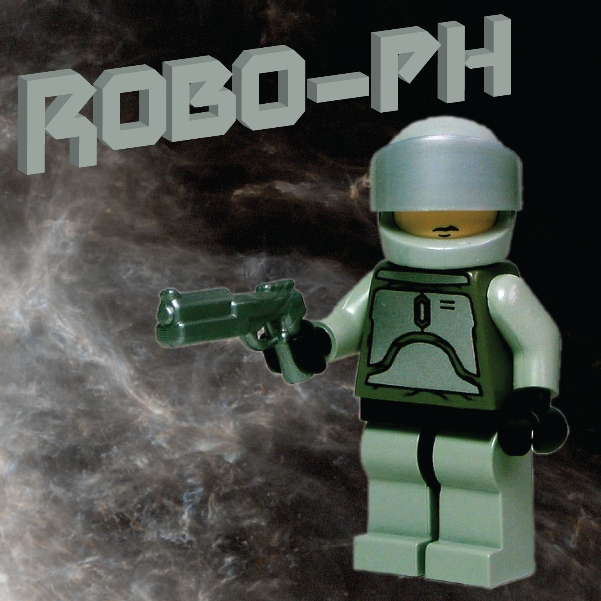

About
=====



Requirements
============

Python
------

* [PyObjC](http://pythonhosted.org/pyobjc/)
* [requests](http://docs.python-requests.org/en/latest/)
* [BeautifulSoup](http://www.crummy.com/software/BeautifulSoup/)

If you have conda, install these with:

```
pip install pyobjc
conda install requests beautifulsoup4
```

if you don't have conda, install with:

```
pip install pyobjc requests beautifulsoup4
```


Other
-----

* [ffmpeg](http://ffmpeg.org/)
* [AtomicParsley](http://atomicparsley.sourceforge.net/)

If you have MacPorts, install these with:

```
sudo apt-get install atomicparsley ffmpeg
```

Running
=======

```
python generate.py
```

Credits/License
===============

The image of the LEGO figure was adapted from [this](https://www.flickr.com/photos/dunechaser/2429621774) image released under a [Creative Commons Attribution-NonCommercial-ShareAlike](https://creativecommons.org/licenses/by-nc-sa/2.0/) license by Andrew Becraft. All images used here that include the LEGO figure are released under the same license.
